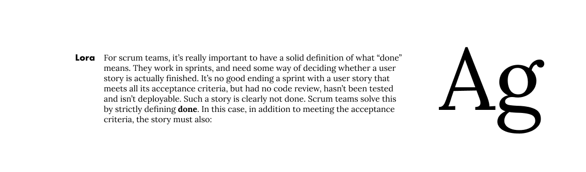
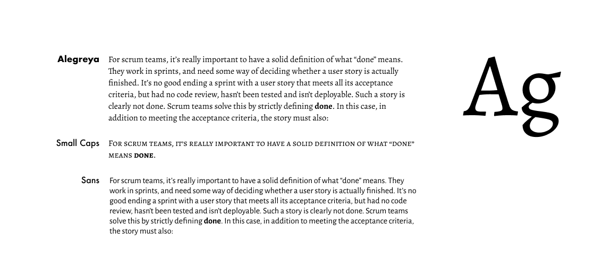

I love typography, but I'm not that good at it. One day I'll take a typography course at a a design school, but in the meantime I need to choose some typefaces for this website. I'm fairly confident I'll need two rather different typefaces in the end. A **essay face** for setting longer-form writing and a **UI face** for everything else. I like the idea of using a very modernist face for the UI and something more old-fasioned and bookish for the essays. It might be hard to make this work but it seems to chime will with my personality – I've always had a tendancy to mix super-modern with traditional oldy-worldy. Trainers and Tweeds, if you will.

I'll explore this in more detail in a future article, but for the time-being let's revisit the four core values I decided on in [Part I](): _Simple_, _Beautiful_, _Authentic_ and _Content-first_. Choosing and pairing typefaces is hard, so to keep things simple we'll start by looking for one. And that last value makes a strong case for starting with the content.

## What do I need from an Essay Typeface

The most obious requirement is that it's very readable. And in particular, **on screens**. It needs to get out of the way and put the content first. It also needs to work well in dark mode, which probably rules out faces with very high stroke contrast (and therefore thin stokes). And to keep things simple, it should also work for headings, quotes, captions and the like –I'd rather not use a third face for this.

As far as feel goes, I'm going for **bookish but definitely of the digital world**. This probably means a serif, but maybe not a really traditional one.

So I'm going to start by looking for faces that are digital natives (ie not redrawings of print faces), which have been designed specifically for readability on the screen. There are a few technical constraints to think about first, though.

## Technical Constrains & Features

It must be open source. While I have a subscription to Adobe Fonts I don't want this project to depend on a paid service. If I can find something that's hosted on Google Fonts so much the better. Because **simplicity**.

I'd _prefer_ a variable font. Mostly because they're new and shiny and fun to play with, but also because it's likely to reduce total page weight. If I go with a variable font, it also needs to have a static version – not all browsers properly support variable fonts yet.

I'll need a good selection of weights in both roman and italic. Probably 200 (light), 400 (normal), 700 (bold) as a minimum. I'll also want support for the following opentype features[^1]:

- Proper small caps
- Both Old-style and and Lining figures
- Nice default and discretionary ligatures
- Fractions

It would be nice to have a proper superscript for footnotes, but this is hardly crucial.

## Checklists

I've bubbled all of that down into a couple of checklists to help me evaluate fonts. On reflection, none of the items are really mandatory – it's important I keep an open mind while I'm exploring. But they're good starter to help narrow down the field.

### Technical Features

- [ ] Open source?
- [ ] Available on Google Fonts?
- [ ] Variable Font? (with static version as fallback?)
- [ ] Wights at least: light (200), normal (400) and bold (700) in italic and bold.
- [ ] Proper Small Caps
- [ ] Old-style and lining figures
- [ ] Nice ligatures (including discretionary)
- [ ] Proper Fractions
- [ ] Other OpenType features that might be fun/useful?

### Style

- [ ] Was it made specifically for the screen?
- [ ] Does it feel bookish?
- [ ] Does it still feel kinda modern?
- [ ] Is it easy to read at very small and very large text-sizes?
- [ ] Also in light and dark modes?
- [ ] Does it work on low-res screens?
- [ ] Is it suitable for both dense paragraph-heavy copy and more sparse copy like lists?
- [ ] Could it work for headings, callouts, quotes and captions too?
- [ ] Does it get out the way?
- [ ] Do I think it's beautiful?
- [ ] Does it feel like me?

## The Shortlist

After a lot of exploration, I've settled on five candidates. None hit all the criteria in the checklists, but a few get pretty close. And I like them all.

---

### Spectral

([Google font page](https://fonts.google.com/specimen/Spectral))

Specral was designed in 2017 as a screen-first typeface. [This article](https://design.google/library/spectral-new-screen-first-typeface/) goes into a lot more detail.

> Spectral is a new and versatile serif face available in seven weights of roman and italic, with small caps. Intended primarily for text-rich, screen-first environments and long-form reading

> Over the past decade, the amount of attention given to readability studies by typeface designers has yielded either bland and conservative results, or overwrought “solutions.” This is more pronounced in screen typefaces than those made for print media, where common pitfalls include overly simplified shapes, “friendly” letters, and facile tricks like unnecessarily upright italics.
>
> In response, Spectral takes an unambiguous stance: Screen typefaces should not look like caricatures of themselves. They should instead be functional text designs that stay interesting enough to convey the many voices that contemporary users need.

At first glance, this seems like it might be a great choice, but after some experimentation the very high stroke contrast makes it feel a bit _too bookish_. It's a bit too spindly, somehow. It also doesn't work that well on dark backgrounds at small sizes.

If I was setting a book on the web, I'd definitely consider this though.

---

### Lora

([Google font page](https://fonts.google.com/specimen/Lora))

{:.full-bleed}

> Lora is a well-balanced contemporary serif with roots in calligraphy. It is a text typeface with moderate contrast well suited for body text.
>
> A paragraph set in Lora will make a memorable appearance because of its brushed curves in contrast with driving serifs. The overall typographic voice of Lora perfectly conveys the mood of a modern-day story, or an art essay.
>
> Technically Lora is optimised for screen appearance, and works equally well in print.

Lora was designed by Olga Karpushina in 2011. It's definitely the least unusual of the five, though the fairly upright italic is beuatiful. This is definitely one that would get out of the way and put the content first.

---

### Alegreya

([Google font page](https://fonts.google.com/specimen/Alegreya))

> Alegreya is a typeface originally intended for literature. Among its crowning characteristics, it conveys a dynamic and varied rhythm which facilitates the reading of long texts. Also, it provides freshness to the page while referring to the calligraphic letter, not as a literal interpretation, but rather in a contemporary typographic language.
>
> The italic has just as much care and attention to detail in the design as the roman. The bold weights are strong, and the Black weights are really experimental for the genre. There is also a Small Caps sister family.
>
> Not only does Alegreya provide great performance, but also achieves a strong and harmonious text by means of elements designed in an atmosphere of diversity.

{:.full-bleed}

I love the fact that Alegreya has a small caps variant and is part of a super family that includes a [sans-serif version](https://fonts.google.com/specimen/Alegreya+Sans) - I was wondering if I could use the sans version for UI copy. But much like Spectral, it almost feels too caligraphic and oldy-worldy-bookish.

---

### Literata

([Google font page](https://fonts.google.com/specimen/Literata))

{:.full-bleed}

Literata is probably one of my favourites. It feels right for the job, somehow. It's got a huge array of varients plus a variable version and some lovely ligatures. It was commissioned by Google and designed by TypeTogether in 2015 and is the default font family in Google Play Books. I'm not sure I like the idea of using a face that so many folks will associate with Google, but as far as versitility and reading experience goes, this is definitely on the shortlist.

---

### Bitter

([Google font page](https://fonts.google.com/specimen/Bitter))

{:.full-bleed}

> Motivated by my love for the pixel I designed Bitter. A "contemporary" slab serif typeface for text, it is specially designed for comfortably reading on any computer or device. The robust design started from the austerity of the pixel grid, based on rational rather than emotional principles. It combines the large x-heights and legibility of the humanistic tradition with subtle characteristics in the characters that inject a certain rhythm to flowing texts.
>
> Bitter has little variation in stroke weight and the Regular is thicker than a normal ‘Regular’ style for print design. This generates an intense color in paragraphs, accentuated by the serifs that are as thick as strokes with square terminals.

This also scores well when it comes to readability, but the fact it's slab serifs and very dark color make it feel a bit too unrefined for use here. It's still on the shortlist though.

---

[^1]: [Here's](https://sparanoid.com/lab/opentype-features/) a good overview of CSS opentype features.
