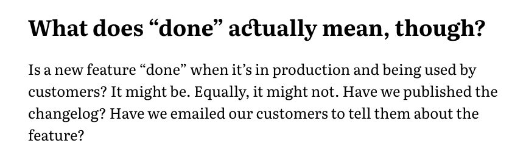

After much messing about with typefaces, I think I've narrowed the choice for essay copy down to two contenders: Literata and Lora. Both feel "bookish" and are designed for long-form reading on screens. Both are open source and available as variable fonts as well as static. Version 3 of Literata not only allows us to vary the weight, but also the optical size. The static version has four optical sizes – each in various weights and italic versions.


The caption variant is designed for small sizes (around 7pt), the regular variant for body copy and the deck and display variants are meant for headings. The variable version gives me pretty fine-grained control over this.

Since I'm not sure which of these two typefaces I prefer, I've decided to bring both of them into the website and switch them out regularly as I'm working to see if one starts to grow on me.

Although I initially wanted to serve fonts via Google Fonts, I've changed my mind. One of my technical principles is _as few dependancies as possible_, and these are both open source I can host the myself. I was finally tipped into this decision because Google Fonts doesn't have the latest version of literate available.

## Building the fonts

I've never had to build fonts from source before, but after much [yak shaving](https://en.wiktionary.org/wiki/yak_shaving) to update my python install and various home-brew packages I was able to run the three build scripts from the Literata repo. It toook a while to work out what they do, but essentially:

1. [`build-static.sh`](https://github.com/googlefonts/literata/blob/master/sources/build-static.sh) builds a bunch of TTF font files from source using the `fontmake` utility. This produces a **lot of files** – one for each weight/style/optical-size combination.
2. [`build-var.sh`](https://github.com/googlefonts/literata/blob/master/sources/build-var.sh) does the same, but for the variable fonts. It only produces two TTFs: roman and italic.
3. [`build-woff.sh`](https://github.com/googlefonts/literata/blob/master/sources/build-woff.sh) takes the TTFs we just built and makes woff and woff2 versions using the `sfnt2woff` and `woff2_compress` utilities.

Since the Lora repo already includes TFF files, I just tweaked `build-woff.sh` a bit and used it to make corresponding woff/woff2 files with the same folder structure as Literata.

After renaming the wolf and woff2 versions of the variable fonts to remove the brackets, I ended up with this in the `fonts` directory of this site...


The whole thing comes in at a whopping 28MB, but that's okay because I'm not actually gonna use most of these in production. I just want them to play with for the moment.

## @font-face Declarations

I [borrowed the Literata font-face declarations](https://github.com/jpamental/moby-dick/blob/master/assets/scss/partials/_00_webfonts.scss) from Jason Pamental's amazing [Moby Dick project](https://mobydick.wales/) and added some similar ones for Lora. I'm pretty sure I'm gonna borrow a lot more from that project over the next few months. They generally follow this format:

```css
@font-face {
  font-family: 'Literata Caption';
  font-style: italic;
  font-weight: 600;
  src: url('../fonts/literata/woff2/Literata-7ptSemiBoldItalic.woff2') format('woff2'),
    url('../fonts/literata/woff/Literata-7ptSemiBoldItalic.woff') format('woff');
  font-display: swap;
}
```

It's been a long time since I actually looked at a @font-face declaration, so if you need a reminder too:

- We're writing a declaration for `Literata-7ptSemiBoldItalic`. This is the **caption**-sized version, in Semibold italic.
- The first three lines specify when this font file should be used. In this case when we set `font-family: 'Literata Caption'` with a weight of 600 and an italic `font-style`.
- The `src` attribute specifies the path to the woff2 version first and falls back to the woff version if that's not supported (woff 2 offers much better compression than woff 1). Since woff is widely supported we're not including any other fallbacks.
- `font-display` tells the browser how to handle font loading. In this case, the browser will render the text in a fallback and then our font in once it's loaded.

The variable font declarations look much the same, but include two values for `font-weight`: the minimum and maximum at which it should be used.

## Using the fonts

Our current CSS sets the font-family for essays using a custom property.

```css
.essay {
  font-family: var(--font-essay);
}
```

As the design evolves, we'll definitely end up with a more complex system for this but for now we can just update the variable to use Literata. We can also tell browsers that support variable fonts to load that instead of the static version.

```css
:root {
  --font-essay: 'Literata', Georgia, 'Times New Roman', serif;

  @supports (font-variation-settings: normal) {
    --font-essay: 'Literata Variable', Georgia, 'Times New Roman', serif;
  }
}
```

I'd like to provide a more robust fallback stack (see [this issue](https://github.com/dannysmith/dannyis-jekyll/issues/28)) but for now, we'll just go to Georgia and TNR.

## Some basic Open Type Features

Literata includes some lovely discretionary ligatures, but we don't want them in the body copy. I've already set `font-variant-ligatures: common-ligatures;` on the `body` in my base stylesheet, but we'll turn on discretionary ligatures for headings across the whole site:

```css
h1,
h2,
h3,
h4,
h5 {
  font-variant-ligatures: common-ligatures discretionary-ligatures;
}
```

{:.border}

## So where are we at?


I'll see which of these two feels best as I work on the site over the next few weeks.

### Reflection on Learning

One of my goals for this project was my own learning, and after some reflection on that I've learned a fair bit during this wanter into web typography...

- I finally read [The Elements of Typographic Style](https://en.wikipedia.org/wiki/The_Elements_of_Typographic_Style) cover-to-cover.
- I've learned a lot about type just by **really looking** at a bunch of different faces.
- I've learned a bit about how digital fonts are made and the tools used to build them.
- I've started to get excited about opentype features in CSS.

I've also re-learned that it's easy to get blocked by indecision on a personal project like this. I could have wasted months trying to find the perfect article typeface and still not been happy with it. As with most things, **any decision is better than no decision**. Especially when it's reversible.
