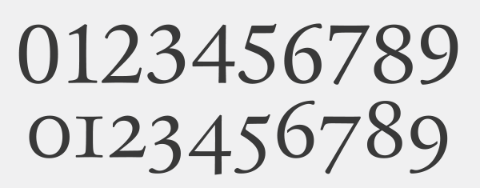
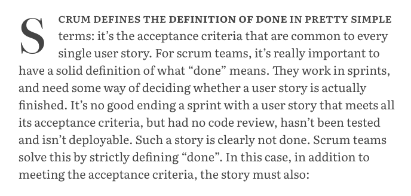

The last part focussed on setting up a basic typographic system using margins and heading styles. In this part, I'm going to make a bunch of little tweaks to the typography of these essays. Over the next few months I'll probably make a whole host of little incremental changes like this.

## Old-style Figures & Fractions

Most good typefaces contain two sorts of figures. Lining figures are designed to sit on the baseline and are generally all the same height. They're great for headings, tables and UI. Old-style figures overhang the baseline and often vary in height. These are great for setting numbers in body copy.



I'm using the default lining figures in most places, but I want to use old-style figures in paragraphs, lists and blockquotes (eg. 1957). I also want to use proper fractions like this &rarr; 3/4.

```css
.essay > p,
.essay > ol,
.essay > ul,
.essay > blockquote {
  font-variant-numeric: oldstyle-nums diagonal-fractions;
}
```

## Bold

Where variable fonts are supported, I'm making strong tags a little bolder than normal.

```scss
strong {
  font-weight: 600;
  @supports (font-variation-settings: normal) {
    font-weight: 625;
  }
}
```

## Abbreviaions

Abbreviations like <abbr title="Hyper Text Markup Language">HTML</abbr> nearly always look best rendered in small caps with a little space between the letters, so I'm doing that for any `<abbr>` elements:

- Use small caps and transform the text to lowercase to we don't get any _proper_ caps mixed in.
- Space out the letters a bit (I'm using `ch` here, which is based on the width of the "0" character).
- Use a low optical size and fall back to _Literata Caption_ where variable fonts aren't supported.
- Use a slightly heavier weight than normal - roughly equivilent to Semibold.
- Set the cursor to _help_ is it has a title attribute.
- Make the dotted underline almost invisible, and position it under the baseline rather than on the baseline.

```css
.essay abbr {
  text-transform: lowercase;
  font-variant: small-caps;
  letter-spacing: 0.05ch;

  font-family: 'Literata Caption', Georgia, 'Times New Roman', serif;
  font-weight: 400;
  font-size: 0.85em;
  @supports (font-variation-settings: normal) {
    font-family: 'Literata Variable', Georgia, 'Times New Roman', serif;
    font-variation-settings: 'opsz' 10;
    font-weight: 410;
  }

  text-decoration-color: rgba(0, 0, 0, 0.15);
  text-underline-position: under;

  &[title] {
    cursor: help;
  }
}
```

## First line & Drop Caps

I'm experimenting with adding drop-cap and small caps for the first line. I'm not yet sure whether I really like this, so will probably revisit later on.



```scss
.essay > p {
  &:first-of-type::first-line {
    text-transform: lowercase;
    font-variant-caps: small-caps;
    font-weight: 500;
    @supports (font-variation-settings: normal) {
      font-weight: 525;
    }
  }

  &:first-of-type::first-letter {
    text-transform: uppercase;
    float: left;
    font-size: 4em;
    line-height: 1;
    padding-right: 0.5ch;
  }
}
```

That's it for now. I'll cover lists, code blocks and links in future articles.
